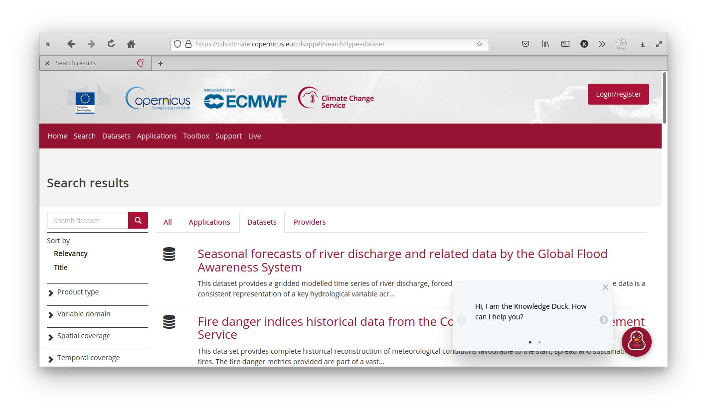

```{r setup, include=FALSE}
knitr::opts_chunk$set(echo = TRUE)
```

## Datos en .csv, .txt, etc

Si de casualidad los datos que vas a usar están en un formato de texto o excel, podés usar cualquier función para leerlos que te resulte cómoda. Cómo siempre es importante tener presente el tipo de dato de cada columna, sobre todo si son datos desconocidos. ¿Tiene columnas con latitudes y longitudes? ¿Están en formato decimal o en grados y minutos? ¿R leyó estas columnas como número o texto? 

De alguna manera este es un punto en contra para este tipo de formatos, no tienen metadatos asociados o al menos *no vienen con el archivo*. En la próxima sección presentaremos un tipo de archivo que si cumple con estas cosas. 

## Datos en netCDF

Uno de estos tipos de formatos muy utilizado en ciencias para guardar datos atmosféricos grillados es el netCDF.
La página web de unidata describe al formato netCDF como:

* Auto-descriptivo: Un netCDF contiene información sobre los datos que contiene

* Portable: Un archivo netCDF puede ser accedido por computadoras que almacenan enteros, caracteres y números de punto flotante de forma diferente. 

* Escalable: Se puede acceder eficientemente a pequeños subsets de grandes bases de datos, incluso desde servidores remotos.

* Anexable: Se pueden añadir nuevos datos pueden añadirse a un archivo netCDF correctamente estructurado sin copiar el conjunto de datos ni redefinir su estructura.

* Compartible. Un escritor y varios lectores pueden acceder simultáneamente al mismo archivo netCDF.

* Archivable. El acceso a todas las formas anteriores de datos netCDF será compatible con las versiones actuales y futuras del software.

Todo ese márketing lo que significa en la práctica es que los datos en netCDF son muy cómodos porque tienen los metadatos incluídos y porque es muy fácil leer sólo las partes necesarias. 
Existen muchos paquetes de R para leer (y escribir) archivos en este formato. 
En este tutorial vamos a usar {metR}.

Los datos en archivos NetCDF puede ser bastante grandes y destruir tu sesión de R si tratás de leerlos enteros en memoria. Por eso, siempre es bueno primero fijarse qué tiene un archivo nuevo. Para eso, {metR} tiene la función GlanceNetCDF que muestra un vistazo de los metadatos del archivo. Vamos a trabajar con un archivo en este formato que contiene datos de reanálisis del NCEP.

```{r}
library(metR)
# Archivo que viene con metR
archivo <- system.file("extdata", "temperature.nc", package = "metR")

metR::GlanceNetCDF(archivo)
```

La salida de esta función muestra las variables que tiene el archivo y sus dimensiones.


:::{.alert .alert-info} 
¿Qué información podés deducir sobre el contenido del archivo a partir de esto?
:::


En este caso, el archivo tiene una sola variable, llamada `air` que es la temperatura media en Kelvin (un archivo netCDF puede tener muchas variables y no todas en la misma grilla). 
De las dimensiones del archivo, se ve que tiene dimensiones de tiempo, nivel, longitud y latitud. 
La latitud va de -90 a 90 y la longitud de 0 a 357.5, por lo que es un campo global.
`level` es la coordenada vertical, que va de 1000 milibares (básicamente la superficie) a 10 millibares (la estratósfera media). 

Podemos hacer la cuenta de cuántas observaciones tiene este archivo:

```{r}
1*17*73*144
```

Que puede leerse sin problema.

Para leer los datos, se usa `ReadNetCDF()`. 


```{r}
temperatura <- ReadNetCDF(archivo)
temperatura
```


## Consiguiendo datos

Ok, pero estos datos son una muestra gratis, ¿cómo hacemos para conseguir más datos?
Hoy vamos a usar una plataforma maravillosa para acceder a una enorme cantidad de datos climáticos y meteorológicos: el [Climate Data Store](https://cds.climate.copernicus.eu/cdsapp#!/home).


En la [parte preparatoria](preparacion.html) ya te creaste una cuenta y seteaste R para pedir datos (y si no, es un buen momento para hacerlo). 
Si hacés click en [Datasets](https://cds.climate.copernicus.eu/cdsapp#!/search?type=dataset) vas a ver todas las bases de datos disponibles. 



Es posible que la mayoría no te suene ni de nombre, y la verdad que a mí tampoco. 
Como ejemplo entonces vamos a descargar datos de [ERA5](https://www.ecmwf.int/en/forecasts/datasets/reanalysis-datasets/era5), el Reanálisis del Centro Europeo de Previsiones Meteorológicas a Plazo Medio.
En particular, vamos a usar 

:::{.alert .alert-info} 
**¿Qué es un reanálisis?***

:::

