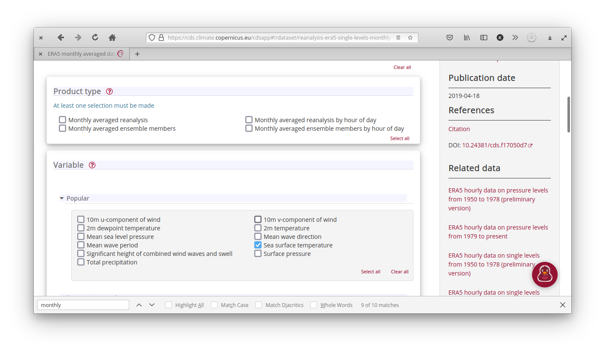
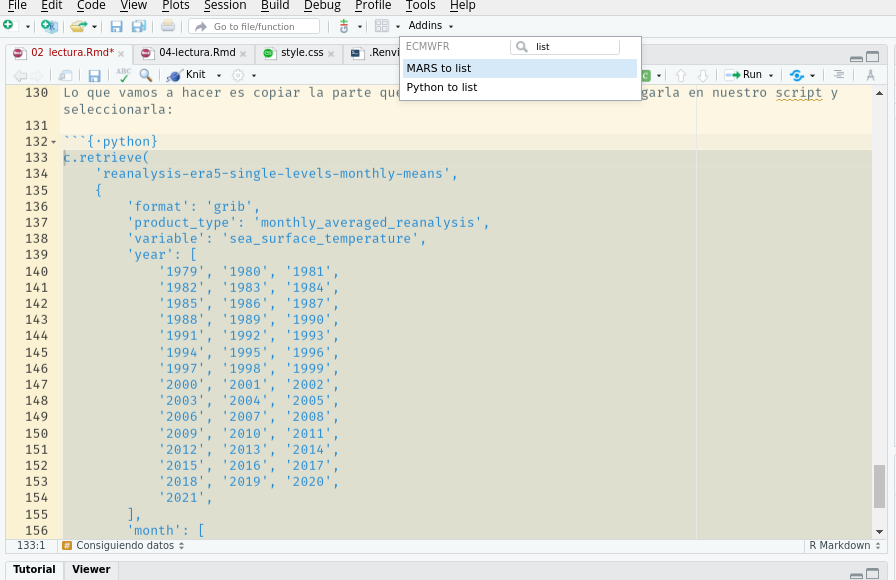

```{r setup, include=FALSE}
knitr::opts_chunk$set(echo = TRUE)
```

## Datos en .csv, .txt, etc

Si de casualidad los datos que vas a usar están en un formato de texto o excel, podés usar cualquier función para leerlos que te resulte cómoda.
Cómo siempre es importante tener presente el tipo de dato de cada columna, sobre todo si son datos desconocidos.
¿Tiene columnas con latitudes y longitudes?
¿Están en formato decimal o en grados y minutos?
¿R leyó estas columnas como número o texto?

De alguna manera este es un punto en contra para este tipo de formatos, no tienen metadatos asociados o al menos *no vienen con el archivo*.
En la próxima sección presentaremos un tipo de archivo que si cumple con estas cosas.

## Datos en netCDF

Uno de estos tipos de formatos muy utilizado en ciencias para guardar datos atmosféricos grillados es el netCDF.
La página web de unidata describe al formato netCDF como:

-   Auto-descriptivo: Un netCDF contiene información sobre los datos que contiene

-   Portable: Un archivo netCDF puede ser accedido por computadoras que almacenan enteros, caracteres y números de punto flotante de forma diferente.

-   Escalable: Se puede acceder eficientemente a pequeños subsets de grandes bases de datos, incluso desde servidores remotos.

-   Anexable: Se pueden añadir nuevos datos pueden añadirse a un archivo netCDF correctamente estructurado sin copiar el conjunto de datos ni redefinir su estructura.

-   Compartible.
    Un escritor y varios lectores pueden acceder simultáneamente al mismo archivo netCDF.

-   Archivable.
    El acceso a todas las formas anteriores de datos netCDF será compatible con las versiones actuales y futuras del software.

Todo ese márketing lo que significa en la práctica es que los datos en netCDF son muy cómodos porque tienen los metadatos incluídos y porque es muy fácil leer sólo las partes necesarias.
Existen muchos paquetes de R para leer (y escribir) archivos en este formato.
En este tutorial vamos a usar {metR}.

Los datos en archivos NetCDF puede ser bastante grandes y destruir tu sesión de R si tratás de leerlos enteros en memoria.
Por eso, siempre es bueno primero fijarse qué tiene un archivo nuevo.
Para eso, {metR} tiene la función GlanceNetCDF que muestra un vistazo de los metadatos del archivo.
Vamos a trabajar con un archivo en este formato que contiene datos de reanálisis del NCEP.

```{r}
library(metR)
# Archivo que viene con metR
archivo <- system.file("extdata", "temperature.nc", package = "metR")

metR::GlanceNetCDF(archivo)
```

La salida de esta función muestra las variables que tiene el archivo y sus dimensiones.

::: {.alert .alert-info}
¿Qué información podés deducir sobre el contenido del archivo a partir de esto?
:::

En este caso, el archivo tiene una sola variable, llamada `air` que es la temperatura media en Kelvin (un archivo netCDF puede tener muchas variables y no todas en la misma grilla).
De las dimensiones del archivo, se ve que tiene dimensiones de tiempo, nivel, longitud y latitud.
La latitud va de -90 a 90 y la longitud de 0 a 357.5, por lo que es un campo global.
`level` es la coordenada vertical, que va de 1000 milibares (básicamente la superficie) a 10 millibares (la estratósfera media).

Podemos hacer la cuenta de cuántas observaciones tiene este archivo:

```{r}
1*17*73*144
```

Que puede leerse sin problema.

Para leer los datos, se usa `ReadNetCDF()`.

```{r}
temperatura <- ReadNetCDF(archivo)
temperatura
```

## Consiguiendo datos

Ok, pero estos datos son una muestra gratis, ¿cómo hacemos para conseguir más datos?
Hoy vamos a usar una plataforma maravillosa para acceder a una enorme cantidad de datos climáticos y meteorológicos: el [Climate Data Store](https://cds.climate.copernicus.eu/cdsapp#!/home).


En la [parte preparatoria](preparacion.html) ya te creaste una cuenta y seteaste R para pedir datos (y si no, es un buen momento para hacerlo).
Si hacés click en [Datasets](https://cds.climate.copernicus.eu/cdsapp#!/search?type=dataset) vas a ver todas las bases de datos disponibles.


Es posible que la mayoría no te suene ni de nombre, y la verdad que a mí tampoco.
Como ejemplo entonces vamos a descargar datos de [ERA5](https://www.ecmwf.int/en/forecasts/datasets/reanalysis-datasets/era5), el Reanálisis del Centro Europeo de Previsiones Meteorológicas a Plazo Medio.

::: {.alert .alert-info}
**¿Qué es un reanálisis?** Los reanálisis combinan previsiones meteorológicas a corto plazo con observaciones mediante la asimilación de datos.
Es una mezcla de observaciones y resultados de modelos meteorológicos que es físicamente consistente y en una grilla regular global.
(Más [acá](https://www.ecmwf.int/en/about/media-centre/focus/2020/fact-sheet-reanalysis))
:::

En particular, vamos a usar los [datos mensuales 2D entre desde 1979](https://cds.climate.copernicus.eu/cdsapp#!/dataset/reanalysis-era5-single-levels-monthly-means?tab=form) y vamos a descargar datos de temperatura de la superficie del mar (Sea Surface Temperature en inglés).

Para descargar los datos de manera programática y reproducible, vamos a usar el paquete de R [ecmwfr](https://bluegreen-labs.github.io/ecmwfr/).
Lo primero que necesitamos es un 'request' válido.
Podemos escribirlo a mano pero es mucho más fácil y menos sujeto a errores si lo nos ayudamos con la página de CDS.

Lo primero que hay que hacer es ir a la página y seleccionar los datos y el período que queremos:



En este caso:

-   Product type: Monthly averaged reanalysis

-   Variable: Mean sea level pressure, Total precipitation y 2m temperature

-   Year: Todos menos 2021.

-   Month: "select all"

-   Time: 00:00 (como son datos mensuales, no tienen tiempo en realidad)

-   Geographical area: Whole available region

-   Format: NetCDF

Con esto poríamos hacer click en "Submit Form" y descargar los datos manualmente, pero vamos a hacer click en "Show API request", lo que nos va a mostrar un código (de PYTHON `r emo::ji("scream")`!)
que descarga los datos.


Lo que vamos a hacer es copiar la parte que empieza con `c.retrieve(`, pegarla en nuestro script y seleccionarla:

``` {.{.{.{·python}}}}
c.retrieve(
    'reanalysis-era5-single-levels-monthly-means',
    {
        'format': 'netcdf',
        'product_type': 'monthly_averaged_reanalysis',
        'variable': [
            'mean_sea_level_pressure', 'sea_surface_temperature', 'total_precipitation',
        ],
        'year': [
            '1979', '1980', '1981',
            '1982', '1983', '1984',
            '1985', '1986', '1987',
            '1988', '1989', '1990',
            '1991', '1992', '1993',
            '1994', '1995', '1996',
            '1997', '1998', '1999',
            '2000', '2001', '2002',
            '2003', '2004', '2005',
            '2006', '2007', '2008',
            '2009', '2010', '2011',
            '2012', '2013', '2014',
            '2015', '2016', '2017',
            '2018', '2019', '2020',
        ],
        'month': [
            '01', '02', '03',
            '04', '05', '06',
            '07', '08', '09',
            '10', '11', '12',
        ],
        'time': '00:00',
    },
    'download.nc')
```

Finalmente, hacer click en Addins y luego en Python to list



Automágicamente todo ese código del malvado Python se va a convertir en una lista de R que es un request válido para bajar los datos:

```{r}
request <- list(
  format = "netcdf",
  product_type = "monthly_averaged_reanalysis",
  variable = c("mean_sea_level_pressure", "sea_surface_temperature", "total_precipitation"),
  year = c("1979", "1980", "1981", "1982", "1983", "1984", "1985", "1986", "1987", "1988", "1989", "1990", "1991", "1992", "1993", "1994", "1995", "1996", "1997", "1998", "1999", "2000", "2001", "2002", "2003", "2004", "2005", "2006", "2007", "2008", "2009", "2010", "2011", "2012", "2013", "2014", "2015", "2016", "2017", "2018", "2019", "2020"),
  month = c("01", "02", "03", "04", "05", "06", "07", "08", "09", "10", "11", "12"),
  time = "00:00",
  dataset_short_name = "reanalysis-era5-single-levels-monthly-means",
  target = "download.nc"
)
```

Esto se puede usar así como está pero hay dos cosas que conviene cambiar.

-   Primero, el campo "target" tiene el nombre del archivo final que por defecto es un genérico `"download.nc"`.
    Mejor cambiarlo por algo descriptivo como `"temperatura_mar.nc"`.
    Luego, la resolución de este campo es de 0.5x0.5 grados, que para ver patrones globales de gran escala es mucho más que lo necesario.

-   Segundo, para tener un archivo mucho más liviano y fácil de manejar, podemos reducir esa resolución a algo como 2.5x2.5 agregando el campo "grid" y seteándolo a \`"2.5/2.5".
    Mirando el formato del request, pueden imaginarse que cambios hacer si quieren bajar menos años, o sólo algunos meses, etc...

```{r}
request <- list(
  format = "netcdf",
  product_type = "monthly_averaged_reanalysis",
  variable = c("mean_sea_level_pressure", "sea_surface_temperature", "total_precipitation"),
  year = c("1979", "1980", "1981", "1982", "1983", "1984", "1985", "1986", "1987", "1988", "1989", "1990", "1991", "1992", "1993", "1994", "1995", "1996", "1997", "1998", "1999", "2000", "2001", "2002", "2003", "2004", "2005", "2006", "2007", "2008", "2009", "2010", "2011", "2012", "2013", "2014", "2015", "2016", "2017", "2018", "2019", "2020"),
  month = c("01", "02", "03", "04", "05", "06", "07", "08", "09", "10", "11", "12"),
  time = "00:00",
  dataset_short_name = "reanalysis-era5-single-levels-monthly-means",
  grid = "2.5/2.5",               # Bajar datos en menor resolución que la default
  target = "temperatura_mar.nc"   # Cambiar el nombre de archivo. 
)
```

Una vez que tenemos el request bien formateado, finalmente es momento de descargar los datos.
Esto se hace con la función `wf_request()`, a la que también le tenemos que decir en qué carpeta guardar el archivo.

```{r eval=FALSE}
archivo <- ecmwfr::wf_request(request, path = "datos")
```

```{r include=FALSE}
archivo <- "datos/temperatura_mar.nc"
```

Esto va a empezar a correr y vas a ver esto:

    Requesting data to the cds service with username xxxxxx
    - staging data transfer at url endpoint or request id:
    xxxxx-xxxxx-xxxxx-xxxxx-xxxxxxx

    - timeout set to 1.0 hours
    \ polling server for a data transfer

Eso significa que R ya le hizo el pedido de datos a CDS, el cual lo va a procesar.
`wf_request()` va a esperar hasta 1 hora hasta que se complete el pedido de datos (para pedidos muy grandes eso se puede cambiar con el argumento `time_out`).

Podés ver tus pedidos de datos en [la sección "Your requests"](https://cds.climate.copernicus.eu/cdsapp#!/yourrequests) del CDS.

Cuando los datos estén listos, vas a ver una barrita de proceso y cuando ésta llegue al 100%, este mensaje:

    - moved temporary file to -> datos/temperatura_mar.nc
    - request purged from queue!

Y listo!
Los datos ahora están en `datos/temperatura_mar.nc`.

Veamos que todo está bien haciendo un glance al archivo:

```{r}
GlanceNetCDF(archivo)
```

## Leyendo variables

Y ahora podemos leer sin problemas.
`ReadNetCDF()` por default trata de leer todas las variables, una en cada columna.
Eso no siempre es posible o deseable, porque distintas variables pueden tener distintas dimensiones; como por ejemplo, si hay variables definidias en 2D mezcladas con variables definidas en 3D.
Entonces lo que se puede hacer es elegir qué variables leer con el argumento `vars`.

Leamos primero la temperatura de la superficie del mar:

```{r}
sst <- ReadNetCDF(archivo, vars = "sst")
head(sst)
```

Lo primero que a mí me gusta hacer cuando leo los datos es mirar el primer campo o un par de campos.
Va a haber más sobre los detalles para visualizar estos datos con ggplot2 más adelante, pero por ahora usemos el viejo y confiable `geom_raster()`.

```{r message=FALSE, warning=FALSE}
# Además, cargo los paquetes necesarios
library(magrittr)
library(ggplot2)
library(dplyr)
library(data.table)
```

##  {.tabset}

### data.table

```{r}
sst %>% 
  .[time == time[1]] %>%  
  ggplot(aes(longitude, latitude)) +
  geom_raster(aes(fill = sst)) 
```

### dplyr

```{r}
sst %>% 
  filter(time == time[1]) %>% 
  ggplot(aes(longitude, latitude)) +
  geom_raster(aes(fill = sst)) 
```

## 

En este gráfico y ase ven varias cosas.
Se ve que hay una clara estructura de mayores temperaturas cerca del ecuador, lo cual no debería sorprender a nadie.
También se ve que, como lo que estamos leyendo es la temperatura de la superficie del mar, tenemos datos faltantes sobre los continentes.
Esto puede molestar un poco para algunas operaciones, ¡pero nos viene bárbaro para tener el contorno de los continentes gratis!
Finalmente, notar que como las longitudes van de 0º a 360º (en vez de -180º a 180º), el mapa sale centrado en el Océano Pacífico.
Esto va a haber que tenerlo en cuenta cuando sea la hora de graficar los continentes con algo mejor que bloques grises.

## Leyendo regiones

Es muy común tener muchos datos en unos pocos archivos netCDF pero necesitar sólo una parte.
Por ejemplo, me voy a poner en los zapatos de un investigador neozelandés que le interese estudiar la temperatura de la superficie del mar cerca de Nueva Zelanda y sus islas cercanas.
En este caso, podría leer sólo una región acotada usando el argumento `subset` :

```{r}
ReadNetCDF(archivo, vars = "sst", 
           subset = list(longitude = c(100, 200),
                         latitude = c(0, -90))) %>% 
  .[time == time[1]] %>% 
  ggplot(aes(longitude, latitude)) +
  geom_raster(aes(fill = sst)) 
```

El argumento `subset` tiene que ser una lista cuyos elementos tienen los nombres de las dimensiones a usar para filtrar y cada elemento es un vector cuyo rango define el bloque de datos a leer.

En el código anterior subset es:

```{r, eval = FALSE}
list(longitude = c(100, 200),
     latitude = c(0, -90))
```

Lo que significa que se van a leer los datos con latitud entre -90º y 0º, y con longitud entre 100º y 200º.


::: {.alert .alert-info}
El argumento `subset` de `ReadNetCDF()` tiene otros aces bajo la manga, como usar `NA` para referirse al mínimo o al máximo o leer regiones discontinuas de datos. Todo eso se puede leer en la ayuda: `?ReadNetCDF()`.
:::
